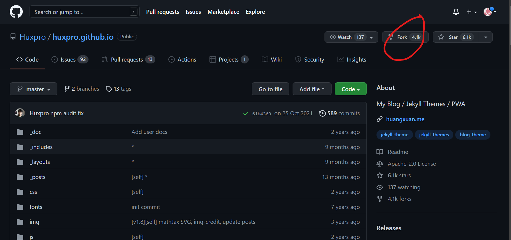
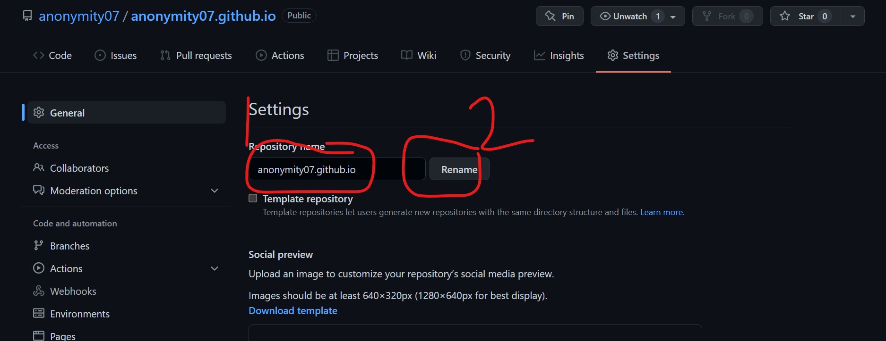
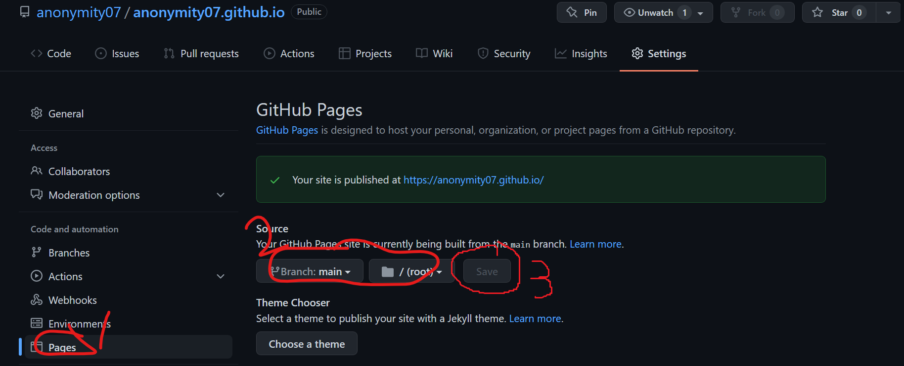

# 建站记
这篇文章简单记录一下本博客的建站过程。
## 目录
- Fork一个jekyll模板仓库(感谢[@Huxpro](https://github.com/Huxpro))
- 更改仓库名，打开Github Pages
- 修改配置文件
- 写博文

## 一.Fork仓库

> 注：这一步可以自己安装jekyll，但是我一直失败......所以这里我选择了fork现成的。

选择一个模板仓库(我选了黄玄大神的)，点击fork。

## 二.更改仓库名并打开Github Pages
进入仓库，点settings，将仓库名改为“username.github.io”(username为你的github用户名)

翻到pages，选择branch：main，/root，save。

## 三.修改配置文件
打开_config.yml，修改个人信息(具体过程略)
## 四.写博文
> 博文文件名格式：yyyy-mm-dd-name.md(name为博客标题)；文章路径：_posts文件夹下

删除原仓库的文章，新建一篇文章(文件名格式如上），在里面用markdown写下你想写的内容吧！
博客到这里已经建好了，接下来要做的：个性化，统计，写文章，等等，以后再说。